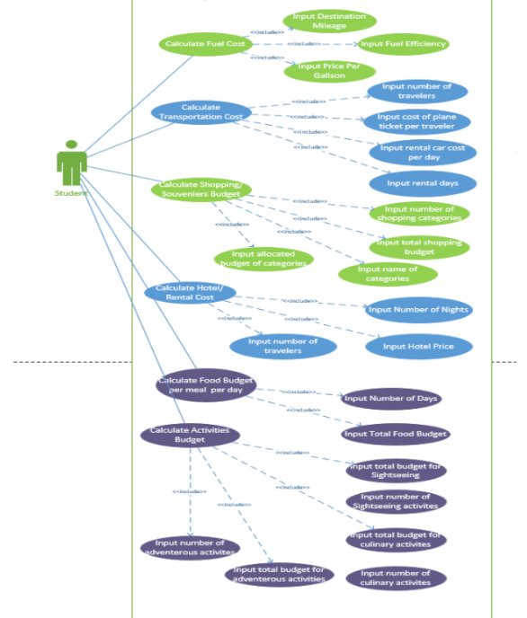
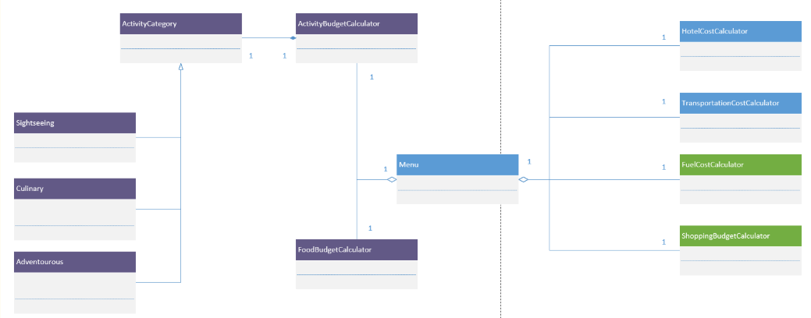

# Spring Break Budget Calculator

## Overview
This project is a Python-based budgeting application designed to help students estimate the cost of a spring break trip. The program includes multiple calculators for major travel expense categories.

## Features
The application includes the following calculators:
- Hotel Cost Calculator
- Food Budget Calculator
- Shopping Budget Calculator
- Transportation Cost Calculator
- Fuel Cost Calculator
- Activity Budget Calculator

## Project Structure
- `main_menu.py` – main menu and navigation
- `hotel_calculator.py` – lodging cost calculations
- `food_calculator.py` – food budget calculations
- `shopping_calculator.py` – shopping/souvenir budget calculations
- `transport_calculator.py` – transportation calculations
- `fuel_calculator.py` – fuel expense calculations
- `activity_calculator.py` – activity budgeting

## Skills Demonstrated
- Python programming
- object-oriented programming (OOP)
- modular code structure
- user input validation
- cost calculation logic
- UML diagrams
- activity diagrams
- sequence diagrams
- class diagrams
- presentation and documentation

## Visual Documentation
Project visuals are included in the `images` folder and include:
- introduction slide
- use case diagram
- class diagram
- activity diagrams
- sequence diagrams
- code screenshots
- application screenshots

## Demo Materials
Demo videos are included in the `demo` folder if file size allows.

## How to Run
1. Open the project in VS Code
2. Run `main_menu.py`
3. Follow the menu prompts to use each calculator

## System Design

### Use Case Diagram

### Class Diagram

## Author
Isabel Jacobs